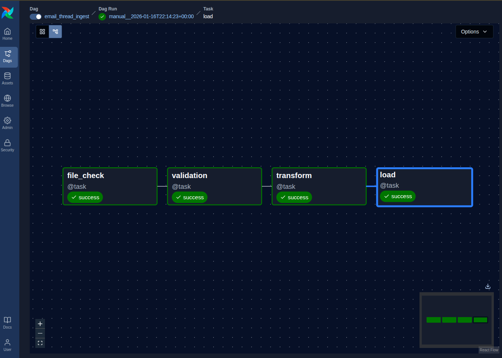

# Email Thread Summary Dataset Pipeline

This folder contains the data pipeline for ingesting, validating, transforming, and loading the **Email Thread Summary** dataset into PostgreSQL.

## Dataset Purpose
The dataset contains summarized email threads with metadata (thread ID, subject, timestamp, from, to, and body).  
It is used for downstream analysis, such as thread volume tracking, sentiment analysis, or customer communication insights.

**Source CSVs Location**:  
`sample_data/email_thread_details.csv` - extracted data
`sample_data/email_thread_details_clean.csv` - cleaned data

**Target PostgreSQL Table**:  
`public.email_thread_details` (created automatically or via DDL script)

## Required Environment Variables

All sensitive configuration is loaded from `.env`.

1. Copy the template:
   ```bash
   cp .env.example .env
    ```

2. Edit `.env` to set your PostgreSQL connection parameters:
   ```env
   EXT_POSTGRES_HOST=your_value
   EXT_POSTGRES_PORT=your_value
   EXT_POSTGRES_USER=your_value
   EXT_POSTGRES_PASSWORD=your_value
   EXT_POSTGRES_DB=your_value
   ```
**Important**: These variables are used by the pipeline to connect to the target PostgreSQL database. Never commit your `.env` to git - add it to `.gitignore`.

## How to Run the Pipeline

## Prerequisites
- Docker & Docker Compose installed


## 1. Start Airflow and PostgreSQL
From the root folder where `docker-compose.yml` is located, run: 

click to access root folder -> [root_folder](../../mfonekpo-project1/docker-compose.yaml)

```bash
docker compose up -d # This runs docker containers in detached mode
```
- wait ~30-60 seconds for Airflow to initialize (Creates DB and admin user).
- Access Airflow UI: http://localhost:8080  
  Login: airflow / airflow

## 2. Verify DAG appears
- DAG ID: email_thread_ingest
- tasks: file_check → validation → transform → load

## 3. Trigger the DAG
- In Airflow UI, toggle the DAG to "on" (top right) to enable
- Click "Trigger DAG" (play button) to start the pipeline run
- Monitor task status and logs in the Airflow UI

Or via CLI:
```bash
docker compose exec airflow-scheduler airflow dags trigger email_thread_ingest
```

## 4. Connecting PGAdmin to Local PostgreSQL (For testing)
before connecting, ensure the PostgreSQL container is running:
1. Install PGAdmin on your host machine.
2. Open PGAdmin and create a new server connection with:
   - **Host**: `localhost`
   - **Port**: `5433 # maps to container's 5432`
   - **Username**: this will be the same as in your `.env`
   - **Password**: this will be the same as in your `.env`
   - **Maintenance** DB: DB var is in your `.env`

## 5. Confirm data is stored in PGAdmin
```sql
    SELECT * FROM public.email_thread_details LIMIT 5;
```

## 6. Shutting down the container
```bash
    docker compose down -v   # -v clears volumes (reset DB if needed)
```

## 7. Troubleshooting
#### Common Errors & Fixes

| Error / Symptom                                      | Likely Cause                                      | Fix                                                                 |
|------------------------------------------------------|---------------------------------------------------|---------------------------------------------------------------------|
| `FileNotFoundError: ...schema_expected.yml`          | Wrong mount path or missing file                  | Check volumes in `docker-compose.yml`, ensure file is in `config/` |
| `FileNotFoundError: ...email_thread_details.csv`     | CSV not in mounted folder                         | Verify `sample_data/` exists and is mounted to `/opt/airflow/sample_data` |
| `TypeError: Type mismatch for 'thread_id'`           | CSV dtype doesn't match YAML                      | Update YAML type or clean CSV data                                  |
| `ValueError: Column 'X' is not nullable...`          | Nulls in non-nullable column                      | Fill missing values or set `nullable: true` in YAML                 |
| `psycopg2.OperationalError: ...connection refused`   | Postgres not ready or wrong credentials           | Wait for container healthcheck, check `.env` credentials            |
| DAG not appearing                                    | File not in `dags/`, syntax error                 | Restart scheduler: `docker compose restart airflow-scheduler`       |


## 8. Reset DAG Runs or Reload Data
- clear all runs for a DAG:
```bash
    docker compose exec airflow-scheduler airflow dags clear email_thread_ingest
```
- Reset PostgreSQL data (drops everything)
```bash
docker compose down -v
docker compose up -d
```
- Reprocess new CSV drop: Place new file in `sample_data/`. re-trigger DAG.

## Runbook: Updating & Onboarding New Datasets
Update Schema YAML or DDL
1. Edit `config/schema_expected.yml` (add/remove columns, change types/nullability)
2. If table structure changes → update/create table in PostgreSQL:
```sql
    DROP TABLE IF EXISTS public.email_thread_details;
    CREATE TABLE public.email_thread_details (
        thread_id INTEGER NOT NULL PRIMARY KEY,
        subject VARCHAR(255),
        timestamp TIMESTAMP NOT NULL,
        "from" VARCHAR(255) NOT NULL,
        "to" TEXT NOT NULL,
        body TEXT
);
```
3. Re-trigger DAG to validate/load with new schema

## 9. Rerun with New CSV Drops

- Drop new CSV into sample_data/ (overwrite or rename as needed)
- Trigger DAG manually in UI or CLI
- Verify data in table

### Please Note:
As one of the requirements for Story-3 `(Respects dataset status field — rows already marked “done” are skipped.)` this dataset does not have status field, so therefore, this part wasn't performed in the cleaning process.

Questions? Reach out to me for clarity.

## A Successful DAG RUN
THis is what a successful dag run looks like for this project
